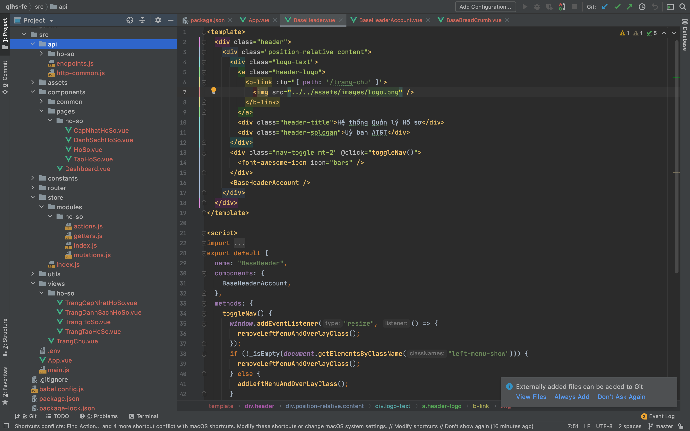
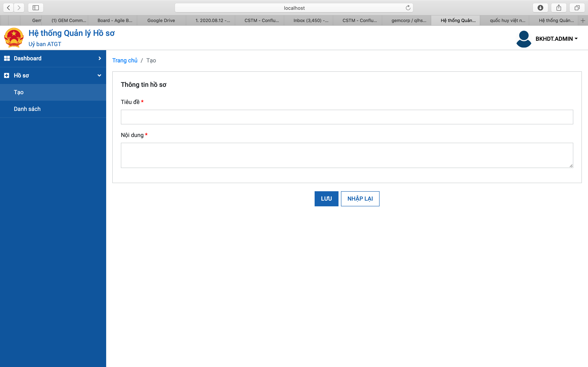
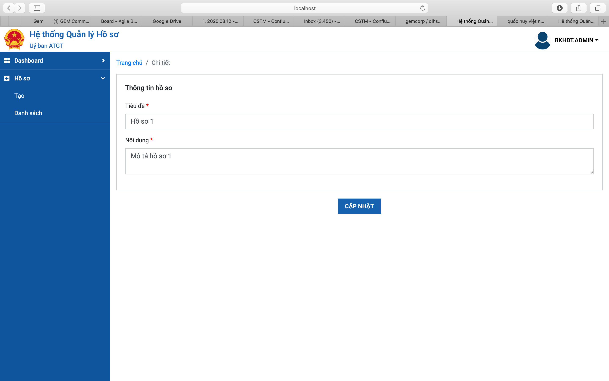
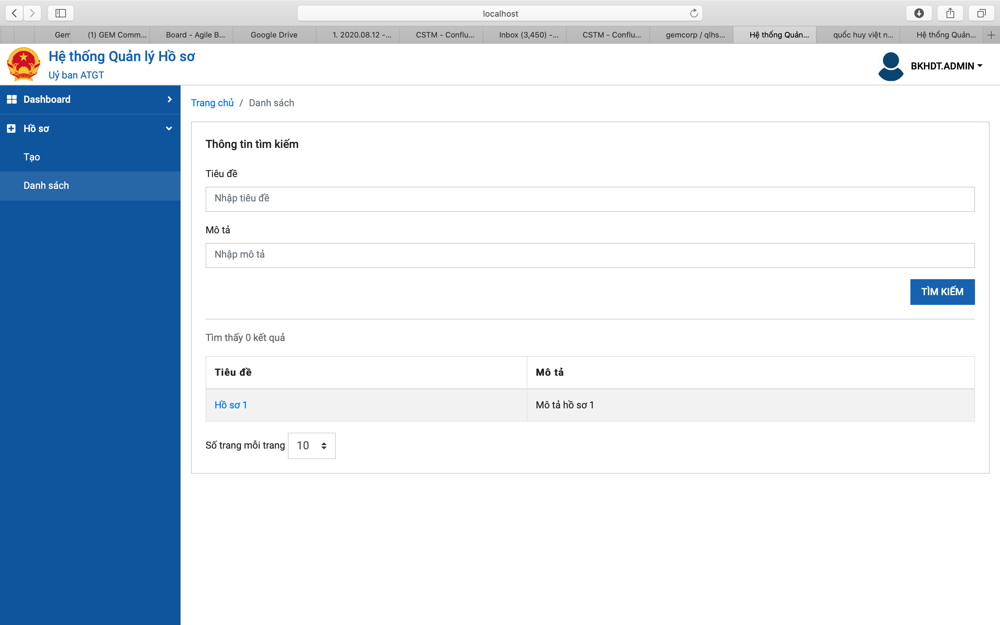

# ATGT - Quản lý hồ sơ

## Project setup
```
npm install
```

### Compiles and hot-reloads for development
```
npm run serve
```

### Compiles and minifies for production
```
npm run build
```

### Lints and fixes files
```
npm run lint
```

#### Project structure 


### Demo features
##### Create target item

##### Edit target item 

##### List target items 


  
### Customize configuration
See [Configuration Reference](https://cli.vuejs.org/config/).
